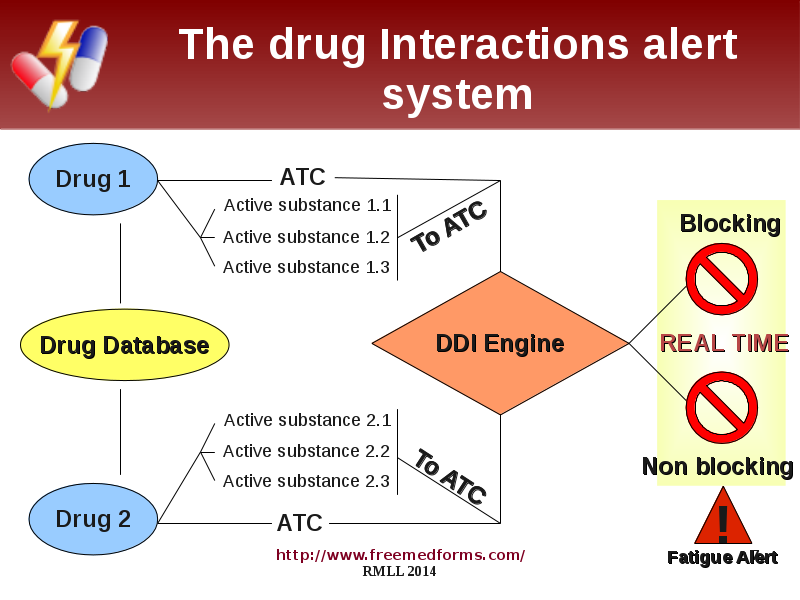

### The FreeMedForms project <http://www.freemedforms.com>

### Free DDI Manager app

Create and use your own set of drug interactions

* Eric Maeker, MD (Fr)
  * creator, main developer
* Jérôme Pinguet (Fr)
  * today's speaker, contributor
* The FreeMedForms team
- - -
####LSM / RMLL 2014, Montpellier
 
 
 
- - -
- - -
- - - 

### Notes

Hello,

Please, let me begin  with a very special thanks and congratulations to the organizers of this event and for their work. I'm really impressed by what benevolent women and men have done for this Libre Software Meeting.  I would also like to thank them for allowing us to present our work today. 

I'm Jérôme Pinguet. I used FreeMedForms for a few months in a medical practice. My previous EMR was not up-to-date and didn't have a Drug-Drug Interactions checker. I'm an active contributor to the project. I'm currently writing my MD thesis about the efficiency of clinical decision support systems to reduce anticoagulant related adverse events.

Eric Maeker is a french physician, C + + / Qt developer, and is the creator and main developer of FreeMedForms.

You can find more information about the FreeMedForms project on our web site: http://www.freemedforms.com/

Today I will present FreeDDIManager, our drug interactions manager. It allows you to create and use your own set of interactions within the FreeMedForms applications.

!

###  The FreeMedForms project

* a suite of medical applications
  * Electronic Medical Record
  * prescription assistant (Computerized Physician Order Entry)
  * drug interactions checker
  * other coding assistants
* Free Software
* License GPLv3
- - -
- - -
- - -
###Notes
FreeMedForms is a suite of medical applications regrouping an Electronic Medical Record manager, a prescriber assistant, some clinical coding assistants. More apps are on the way.
All applications are free, open source and released under the GPLv3 licence.

!

###  The FreeMedForms community
* not-for-profit community
  * medical doctors
  * computer workers/scientists
  * pharmacist
* about 50 members (10 active members)
* supported by OpenSuse Medical, Debian Med, Fedora Medical, Arch Linux
* collaboration with free software EMR projects: GNUmed, FreeMed, Care2X, SynapseEMR
* totally independent
 * from pharmaceutical industry
 * from proprietary software industry
* declarations of interests of active members available on website
- - -
- - -
- - -

###Notes
The project is driven by a community of medical doctors and computer workers and was created on the pulse of a french team.

All contributor must declare his/her conflict of interests. Contributors that are not totally independant of the pharmaceutical industry and/or the proprietary socftware industry will not be able to join our team.

All the FreeMedForms community want to thank the Debian Med team that supports our project. Thanks to this help, FreeMedForms is fully available in the official stable repository since a long time. Eric is now an active member of the Debian Med team.

The project is also supported by the FedoraMedical and OpenSuse Medical teams.

!

###  The FreeMedForms project

* __GNU/Linux, FreeBSD, MacOs X, Win32, Win64__
* C++ using Digia's __Qt__ libs
* documented using Doxygen
* massive usage of MVC architecture and __unit-tests__
* Built using dynamic libraries with __plugins architecture__
* database: SQLite and/or MySQL/MariaDb

- - -
- - -
- - -

### Notes
All applications are available for Linux, Mac, FreeBSD and Windows.

The project is coded in C++ with Qt libraries and a massive usage of the model/view/controller architecture. The code is documented using Doxygen. 

__Many unit-tests are available and code safety is regularly checked before any release__.

Applications are built using shared libraries and plugins architecture which allow us to easily add/remove new functionalities.

The roadmap and the issue reporting are available on our wiki web site and Google Code / GitHub.

We are using SQLite and/or MySQL (MariaDB) for the databases.

!

###  Classifications to understand drug interactions

Some useful and sometimes problematic classifications  

* Drugs
 * ATC Anatomical Therapeutical Chemical classification
 * INN International Non-Proprietary Name

* Diseases
 * ICD10 : International Classification of Diseases version 10

- - -
- - -
- - -

### Notes
The FreeMedForms project can manage some internationally defined classifications :
. For drugs we use the ATC which is copyrighted and owned by WHO. It defines INN for drug component and/or drugs (association for eg).
. For disease, we currently use the ICD version 10. Our implementation of the ICD10 is respectfull of thecomplete specifications of this classification like dag/star coding, diagnosis inclusion/exclusion.

!

###  What is a drug interaction?

A drug can interact with  

* another drug: __drug-drug interaction__ (__DDI__) 
* patient's conditions: __patient-drug interaction__
 * acute or chronic disease
 * allergy, intolerance
 * renal filtration
 * age
* food & alcohol: __food-drug interactions__ (__FDI__)
* labtest-drug interactions: drug efficiency monitored by lab tests
* Potentially Inappropriate Medications __PIM__ specific interactions regarding elderly

- - -
- - -
- - -
- - -

###Notes

Here are some definition and abbreviations widely used

Drug can interact with multiple source:
- it can interact with another drug creating a DDI.
- it can also interacts with patient condition like drug allergy or intolerance, chronic or acute active diseases, age, renal filtration, weight, body surface...
- some drugs must be screened using labtests (like INR / AVK, digoxin...) defining labtest-drug interaction
- some drugs should not be used or be used with caution with elderlies (old people) defining PIM

??Shouldn't we use drug/disease & drug/allergy??
And reverse lab-drug to drug-lab interaction ?
Problem: drug-lab interaction is used in many articles with the meaning of "attempt to prescribe a molecule contraindicated in renal insufficiency and recent low clearance lab test result --> alert" and the way you present it might refer to "drugs that have an effect on laboratory tests such as increasing or lowering K+" or even "drug interaction with chemical reactant used in a lab test procedure"

!

###  Drug interactions

__Drug interactions create severe even fatal adverse events__

* __Always growing__
 * Number of marketed drugs
 * Number of known drugs interactions
 * Number of prescribed drugs
 * Preventive treatment
* __Elderly are at increased risk__
 * many diseases means many therapies
 * many diseases means altered physiology

- - -
- - -
- - -
- - -
###Notes

A drug interaction can be enough to cause severe and even fatal adverse effects. 

The number of marketted drugs is always growing, as the number of prescribed drugs per patient. Our knowledge of the potential interactions is also each year more acute. The number of possible interactions is quickly growing: computerized processing of interactions is a much needed tool to help practitioners in their day-to-day practice.

When FreeMedForms was started a special attention was paid to DDI management. We identified non-conflicting sources freely available and compiled them into one unique database.

This work was the starting point of FreeDiams in 2008. FreeDiams is the FreeMedForms prescriber built as a standalone application. FreeDiams can communicate with external EMRs through XML exchange files.

!

###  Drug Interactions alert system

- - -
- - -
- - -
###Notes
The interaction engine analyzes all combinations of drugs per couple. Each molecular component is analyzed after being linked to an internationally recognized and persistent over time coding system called ATC (which means Anatomical Therapeutic Chemical). The ATC classification is owned by the World Health Organization.

The DDI engine calculates interactions in real time. Each time a drug is added or removed of the prescription, all interactions are recalculated. The process is done twice when prescribing a cure, I'll explain this later.

If the tool is effective in detecting interactions, it must signal them so that practitioners adhere to the warnings. Otherwise the tool is useless. Alert fatigue is a well known effect of redundant, clinically irrelevant, or even non significant alerts. Practitioners suffering from this syndrome will override all alerts whatever their content and level of risk.

So we had to define a strong alert philosophy.

!

###  Timing of the alert system

- - -
- - -
- - -

###Notes
The timing of the alert system is really important too.

Practitioner may have to be warned of interactions before he selects drugs, during the selection and when the dosing of the drug is completed.

This short diagram shows the different phases of the alert computation and their emergence.

!

###  Free DDI Manager
* __Motivation__
 * Allow users to __create__ their own drug interaction set
 * Allow users to __share__ their own drug interaction set
 * Facilitate the contribution process
* __Current status__
 * Beta version, some features still missing, but mainly usable
 * All FreeMedForms drug databases are created by Free DDI Manager
* Future developments
 * Include javascript in drug interaction management (eg anticoagulant management: a lab-drug interaction model)
 * create a server to facilitate data sharing

- - -
- - -
- - -
###Notes
We want to ease the creation, the contributions and sharing of DDI very easy inside the FreeMedForms project. Some tools were tested but none was really efficient.
The FreeDDIManager was created to answer to this need. We chose to write a hard-coded application instead of a webportal as all our applications are still hard-coded. There are _no__ roadmap to swich to a webapp design.
Currently, FreeDDIManager is in beta stage. We already use it to create and update our drugs related datapack server.

In a near future, we plan to include javascript inside DDI definition to allow users to access to any other database, to access patient data and interact with user.

!

###  Free DDI Manager workflow: drug database

* This part allow users to prepare any drug database
* Get drug database raw source
 * France
 * USA
 * Canada
 * South-africa
 * Belgium
* Transform raw source into computable source
* Extract all drug components

- - -
- - -
- - -
###Notes

In order to create our drug database, we found free drugs databases published by governmental structures for the folowing countries : France, USA, Canada, South-Africa, belgium and portugal. These drug databases can be automatically processed using FreeDDIManager without any user configuration.
Raw sources are processed for the needs of the FreeMedForms database scheme.

!

###  Free DDI Manager workflow: prepare drug recognization

* Edit ATC classification (not required)
* Edit interactors
 * Interactors database is independant of the drug database
 * 1 interactor can be 1 ATC code, drug component, class/group of ATC/interactors/classes
* Edit all drug components
 * Link with an interactor or ATC code (partially by hand)
 * Check,review, comments: done by hand
* data can be shared between users
- - -
- - -
- - -
- - -
###Notes

The workflow of drug database creation includes needs:
- a full ATC classification (that will be released with the release version)
- a definition of interactors. An interactor can be a unique ATC or multiple ATC codes, it can be a component name, or a groupment of interactors.
- You will also need all the drug components of your database and you will need to link them to an ATC code or an interactor.
- this work must done by hand and we developed tools to help community in this process.
- All data created with FreeDDIManager can be shared between users.

This slide will become clearer after watching the video  
component = molecule  
interactor = molecule type (ATC)
eg fluindione (main long term anticoagulant in France): no ATC, no INN
Interactor linked to cytochrom P450: all substrate or all inhibitors

!

###  Free DDI Manager workflow: create a DDI

* Drug-drug interactions are currently limited to 2 interactors interactions
* DDI are defined using a risk model, a preventive/management message and bibliographic references from PubMed.org
* DDI must be checked and reviewed by hand
* FreeMedForms community wants to create a free and open source DDI database usable in any country
* We created an «Interaction Committee»
* Legal and medico-legal issues are not yet clearly defined and solved.
- - -
- - -
- - -
- - -
- - -
- - -
###Notes

Tu devrais écrire ton texte.

!

###  Interactions Committee

* Shah et al. 2006: "high user acceptance of ambulatory computerized prescribing alerts when using a selective knowledge base and minimizing workflow interruptions"
* commercial knowledge bases
 * highly inclusive
 * emphasis on breadth of coverage, not on clinical relevancy or severity of adverse events
 * conflits of interests: directly or indirectly owned by pharmaceutical industry

###Notes

Tu devrais écrire ton texte. Ce que tu dis peut compléter la diapo, tu n'es pas forcé de lire la diapo.
Attention, sans ton texte tu risques de bafouiller...

!

###  Interactions Committee

* Maintain a drug interaction database
 * Free and open source
 * 100% Independant
 * Community driven
* Review drug interactions
* Evidence Based Interactions: references (PubMed), Summary of Product Characteristics
* Lobby academic, governmental, institutional interactions committees
 * use & contribute to FreeDDIManager

###Notes

Tu devrais écrire ton texte. Ce que tu dis peut compléter la diapo, tu n'es pas forcé de lire la diapo.
Attention, sans ton texte tu risques de bafouiller...

!

###  FreeDDIManager – Future devs

* Some interactions or labtest-drug interaction needs some processing
* Management of interaction javascript in the interaction engines
* See roadmap of the VKA plugin
- - -
- - -
- - -
- - -
- - -
- - -

###Notes

Rédiges ton texte

!

###  Free DDI Manager workflow: manage datapacks

* Create a datapack and a "datapack server"
* Upload Packs
* Share server configuration
* Users only have to configure your server and select Packs to install
- - -
- - -
- - -
###Notes

FreeMedForms project DataPack management is a quite easy and fast process to add functionalities to any applications of the project.
Datapacks represent pure data, patient forms, scripts, binaries and many other potential.
FreeDDIManager allow you to create in some mouse-clicks a datapack server. A server can be a local path or a remote server. When the server is built, you just have to send to your users the URL of the server and their login information.
Application can manage as many server as you want and correctly manages dependencies between packs, application version limitations, pack version, pack update...

A full documentation is available on our website.

!

###  Alert philosophy

* Two kinds of alerts:
 * __Non-blocking__ → icon and tooltip
 * __Blocking__ → blocking dialog, require user action
* Alert system provides three levels: low, medium, high
* And an infinite number of __categories__ (DDI, PIM, drug
duplication, dose checking, allergies, intolerances...)
* __Threshold__ of alerts can be adapted by the user for each
type of alerts
* Alerts can be __dynamic__ (using scripting)
* We do our best to avoid alert fatigue

- - -
- - -
- - -

###Notes

Last year, Eric presented the alert system of the FreeMedForms project at the LSM in Brussels. The video is available.

We defined two systems of alert: one blocking and one non-blocking.

The non-blocking alert is represented by and icon and tooltips in views. While the blocking alerts are blocking dialogs that needs user validation to proceed. Both alerts present minimal and sufficient information. At any time users can access (to) full alert information.

The alert system provides three levels of risk : low medium and high. And each alert can be classified in an inifinite number of categories.

The threshold of each type of alert can be adapted by the user in the user preferences.

###References

* Phansalkar, S., J. Edworthy, E. Hellier, D. L. Seger, A. Schedlbauer, A. J. Avery, and D. W. Bates. “A Review of Human Factors Principles for the Design and Implementation of Medication Safety Alerts in Clinical Information Systems.” Journal of the American Medical Informatics Association 17, no. 5 (September 6, 2010): 493–501. doi:10.1136/jamia.2010.005264.

###Notes

!

###  FreeMedForms needs you!
* A great community
* __Non-profit association__ -> official support
 * http://asso.freemedforms.com 
* __Wanted__: devs, testers, translators, medical doctors, pharmacists, articles, reviews, retweets
* Unfunded... __$__, __€__, __฿__ welcome by the registered not-for-profit association
* Code on GitHub <https://github.com/FreeMedForms/freemedforms>
* Web <http://www.freemedforms.com>
* Mailing List <freemedforms@googlegroups.com>

- - -
- - -
- - -
###Notes

A french non-profit association was created in january 2013 with the unique objective to support the FreeMedForms community. The association is unique provider of the official support of the suite.

!

### References

* [1]
* [2] Phansalkar, S., J. Edworthy, E. Hellier, D. L. Seger, A. Schedlbauer, A. J. Avery, and D. W. Bates. “A Review of Human Factors Principles for the Design and Implementation of Medication Safety Alerts in Clinical Information Systems.” Journal of the American Medical Informatics Association 17, no. 5 (September 6, 2010): 493–501. doi:10.1136/jamia.2010.005264
* [3] 
* [4]
* [5]
* FreeMedForms complete bibliograpical references freely available on our Zotero group: https://www.zotero.org/groups/freemedforms

###Notes

Si tu ajoutes des références il en faudrait sur les interactions médicamenteuses et en particulier sur l'anamlyse du contenu des bases du commerce. Cf article espagnol. Je l'ai pas sous la main...

!

### Thank you!

* Thank you for listening
* Eric says "Kisses to my wife and children (who support my devs...)"
* Jerome says: "Thank you Eric for coding so fast and so well, thanks to the international FMF community for your contributions and for sticking with us despite our bad english! :)"

Now I will present a short video of the FreeDDIManager. You will see how easy it is to build and share your own set of interactions.

Thank you.

!

###I'll be around today & available for discussion or meeting: Email/XMPP/Jabber/GPG: jerome@jerome.cc +33611770269
